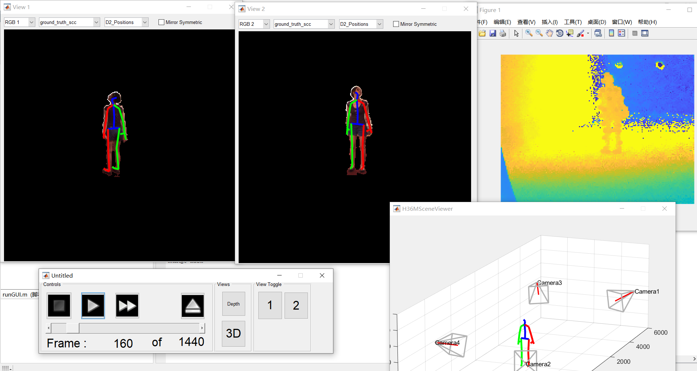

# Introduction

This is the code from human3.6m.  
I have updated the code of the player to make it run in the latest matlab.




# Change the path of dataset
Please change the path in the H36.conf
```
H36MDemo/H36M.conf
```


# Prepare the human3.6m dataset
Folder structure of **data** should be as follows:
```
└── S1
    ├── MyPoseFeatures
    │   ├── D2_Positions
    │   ├── D3_Angles
    │   ├── D3_Positions
    │   ├── D3_Positions_mono
    │   └── D3_Positions_mono_universal
    ├── MySegmentsMat
    │   ├── depth_pure
    │   └── ground_truth_bs
    ├── TOF
    └── Videos
```

# How to run the player
Please run the following commands in matlab
```matlab
cd H36MDemo
runGUI
```


# Known issues
When opening the different views, the player will crash!
You can add a breakpoint in H36MGUI\H36MGui.m
```
APPLICATION.visualiser.updateView(nv);
```
